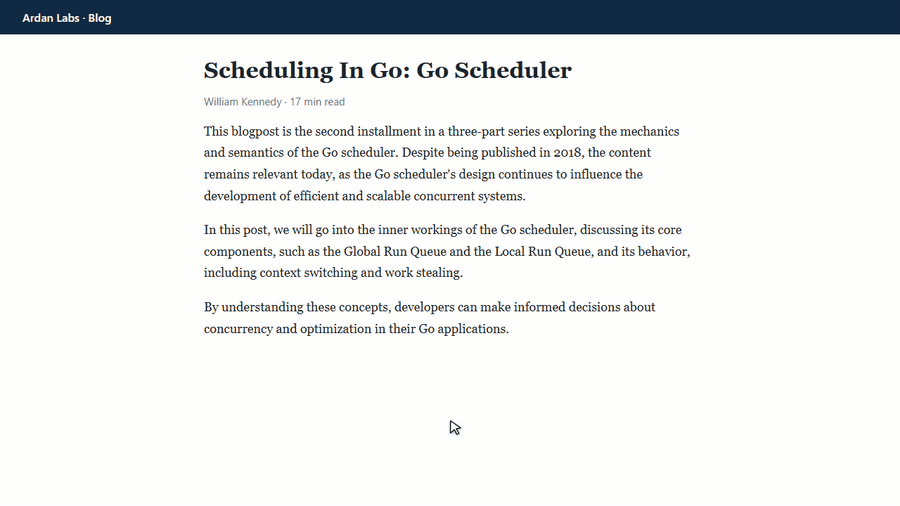

<div align="center">


# Tuyewn Reader

Extension Chrome/Edge để đọc bài tiếng Anh trên web: nghe đọc, xem phiên âm, tra nghĩa tiếng Việt và luyện nói theo, ngay trên trang đang mở.

</div>

<p align="center">
  <a href="docs/demo.mp4"></a>
  <br>
  <sub>Bấm vào ảnh để xem video demo có tiếng (MP4, khoảng 1 phút 40 giây)</sub>
</p>

## Tại sao mình làm cái này

Mình đọc tài liệu tiếng Anh hằng ngày và hay vướng mấy chuyện: không biết từ này đọc sao cho đúng, gặp từ lạ lại phải mở tab từ điển, đọc hết một đoạn dài vẫn không chắc mình hiểu đúng ý. Các công cụ sẵn có thì mỗi cái làm một việc, nên mình gom lại thành một extension.

Cách dùng đơn giản: bôi đen đoạn văn, chuột phải, chọn Tuyewn Reader. Panel mở bên phải, bấm play là nghe.

## Có gì trong đó

**Nghe đọc**

- Giọng đọc lấy từ dịch vụ Read Aloud của Microsoft Edge (Andrew, Ava, Emma, Brian, Sonia, Ryan...), nghe khá giống người thật. Chọn được giọng Mỹ hoặc Anh, tốc độ từ 0.5x đến 2x.
- Từ đang đọc được highlight trên trang và trong panel. Câu chưa đọc bị làm mờ để mắt dễ bám theo.
- Phụ đề tiếng Việt hiện ở cuối trang giống YouTube. Bật/tắt bằng nút CC hoặc phím `C`, chỉnh được cỡ chữ, vị trí, nền.
- Thanh thời gian ghim cuối trang, cho biết đã đọc bao lâu, còn bao lâu. Bấm vào thanh để nhảy tới đoạn khác.
- Nếu giọng Edge bị lỗi (dịch vụ này không chính thức, thỉnh thoảng chập chờn), extension tự chuyển sang giọng có sẵn trên máy, thường là Microsoft Mark, rồi thử lại sau một phút.

**Đọc hiểu**

- Bản dịch tiếng Việt theo từng câu. Có thể ẩn bản dịch để tự đoán nghĩa trước, bấm vào mới hiện.
- Tóm tắt đoạn văn bằng tiếng Anh và tiếng Việt qua Gemini (cần API key miễn phí).
- Đọc cả trang: tự tìm phần nội dung chính, bỏ menu, quảng cáo, footer.
- Chỉ đọc chữ: bỏ qua email, code, emoji, hình, số chú thích và link. Link đứng riêng (menu, "Read more", danh sách bài, tag) hoặc link là địa chỉ web thì bỏ; link nằm giữa câu vẫn đọc để câu không bị cụt. Muốn bỏ hết thì bật "Bỏ qua cả link nằm giữa câu" trong menu Aa.
- Muốn đọc một vùng cụ thể thì chọn điểm bắt đầu và kết thúc bằng hai cú click.

**Từ vựng và phát âm**

- Bấm vào một từ để xem phiên âm IPA giọng Mỹ và giọng Anh (bấm loa để nghe từng giọng), loại từ theo ngữ cảnh, nghĩa tiếng Việt.
- IPA được tách thành từng âm. Rê chuột lên một âm sẽ thấy gợi ý cách đọc kèm từ ví dụ.
- Mở YouGlish, Forvo, Google, Cambridge, Longman, Oxford trong cửa sổ popup để nghe người bản xứ đọc. Extension chỉ mở trang gốc, không lấy dữ liệu từ các trang này.
- Có thể hiện IPA và nghĩa tiếng Việt ngay dưới mỗi từ, hoặc tô màu theo loại từ.
- Tab Từ vựng gom từ theo loại, copy được sang Excel, Google Sheets hoặc Anki.

**Luyện nói theo (shadowing)**

Bật nút lặp câu thì mỗi câu được đọc 1 đến 5 lần. Sau mỗi lần có một khoảng nghỉ để bạn nói lại, có tiếng bíp báo đến lượt và đồng hồ đếm ngược. Câu đang luyện được tô cam trên trang.

**Giao diện**

Panel đẩy nội dung trang sang trái chứ không đè lên bài. Kéo cạnh trái để đổi độ rộng, thu nhỏ thành nút tròn khi không dùng. Có giao diện sáng và tối.

## Cài đặt

Extension chưa lên Chrome Web Store nên phải cài thủ công:

1. Tải code về: `git clone https://github.com/tuyndev18/tuyewn-translator.git` hoặc Code → Download ZIP rồi giải nén.
2. Mở `chrome://extensions` (Edge thì `edge://extensions`).
3. Bật Developer mode ở góc trên bên phải.
4. Bấm Load unpacked, chọn thư mục vừa tải.
5. Nên ghim icon extension lên thanh công cụ cho tiện.

Cần Chrome hoặc Edge 116 trở lên. Dịch trên máy cần Chrome 138 trở lên.

## Sử dụng

| Muốn làm gì | Cách làm |
|---|---|
| Đọc một đoạn | Bôi đen, chuột phải, chọn "Tuyewn Reader: đọc ..." |
| Đọc cả trang | Chuột phải vào trang, chọn "đọc cả trang". Hoặc bấm icon extension khi không bôi đen gì |
| Đọc một vùng | Chuột phải, chọn "chọn điểm bắt đầu → kết thúc", rồi click vào chỗ bắt đầu và chỗ kết thúc |
| Tra từ | Bấm vào từ trong panel hoặc trên đoạn đang đọc |
| Luyện nói | Bật nút lặp câu trên thanh công cụ. Số lần lặp và thời gian nghỉ chỉnh trong menu Aa |

Phím tắt:

| Phím | Tác dụng |
|---|---|
| `Alt+Shift+E` | Đọc đoạn đang bôi đen, không bôi đen thì đọc cả trang |
| `Space` | Phát / tạm dừng |
| `←` / `→` | Câu trước / câu sau |
| `R` | Bật/tắt lặp câu |
| `C` | Bật/tắt phụ đề |
| `Esc` | Đóng menu, huỷ chọn vùng |
| Double-click một từ | Đọc từ chỗ đó |

## Lần đầu dùng

- Khi panel hỏi "Bật dịch trên máy của Chrome", bấm Bật. Chrome tải gói Anh-Việt một lần, sau đó dịch không cần mạng và không bị giới hạn.
- Muốn dùng tóm tắt thì lấy key ở [Google AI Studio](https://aistudio.google.com/apikey) (không cần thẻ), dán vào ⚙ → Gemini. Extension chỉ dùng model có gói miễn phí và tự chọn bản mới nhất.
- Trong ⚙ có thể đổi giọng. Mấy giọng có chữ Multilingual nghe tự nhiên nhất.

## Dữ liệu lấy từ đâu

| Phần | Nguồn |
|---|---|
| Giọng đọc | Microsoft Edge Read Aloud. Dự phòng: giọng có sẵn của trình duyệt |
| Loại từ, tách câu | [compromise](https://github.com/spencermountain/compromise), chạy trên máy |
| IPA, nghĩa tiếng Anh | [Wiktionary](https://en.wiktionary.org) |
| Nghĩa tiếng Việt | Translator API của Chrome (dịch trên máy). Dự phòng: Google Translate, Gemini, MyMemory |
| Tóm tắt | Gemini API, dùng key của bạn |
| Từ điển, phát âm | Oxford, Cambridge, YouGlish, Forvo, Longman, Google (mở trang gốc trong popup) |

## Quyền riêng tư

Extension chỉ chạy trên tab khi bạn gọi nó (chuột phải, bấm icon hoặc phím tắt), không tự đọc các trang bạn mở. Đoạn văn bạn chọn sẽ được gửi tới dịch vụ dịch, giọng đọc hoặc tóm tắt tương ứng. Nếu đã bật dịch trên máy thì phần dịch không đi đâu cả. Gemini key lưu trong `chrome.storage.local`, không đồng bộ, chỉ gửi tới API của Google. Không có server riêng, không thu thập gì.

## Hạn chế

- Giọng đọc Edge và Google Translate là endpoint không chính thức, có lúc bị chặn hoặc lỗi. Extension sẽ chuyển sang nguồn dự phòng.
- Không chạy được trên file PDF, trang `chrome://` và Chrome Web Store. Ở đó đoạn bôi đen sẽ mở trong một cửa sổ đọc riêng.
- Với các trang kiểu ứng dụng như Gmail hay mạng xã hội, "đọc cả trang" có thể chọn sai phần nội dung. Dùng chọn điểm bắt đầu/kết thúc sẽ chính xác hơn.

## Cấu trúc code

JavaScript thuần, Manifest V3, không cần build.

```
manifest.json        khai báo extension
background.js        service worker: menu chuột phải, inject script, dịch, Wiktionary, Gemini, popup từ điển
content.js           panel (Shadow DOM), trình đọc, highlight, thẻ từ, lặp câu, đọc cả trang
edge-tts.js          client giọng đọc Edge (WebSocket)
offscreen.html/.js   offscreen document chạy edge-tts.js
rules.json           rule declarativeNetRequest cho endpoint giọng đọc
highlight.css        style cho CSS Custom Highlight API
reader.html/.js      cửa sổ đọc riêng khi không chạy được trên trang
lib/compromise.js    NLP
icons/
```

Sửa code xong thì vào `chrome://extensions`, bấm reload ở Tuyewn Reader rồi tải lại trang.

## Ghi công

- [compromise](https://github.com/spencermountain/compromise) (MIT)
- Dữ liệu phiên âm và định nghĩa từ [Wiktionary](https://en.wiktionary.org) (CC BY-SA)
- Giọng đọc Microsoft Edge Read Aloud. Bản dịch từ Chrome Translator API, Google Translate, MyMemory, Google Gemini.
